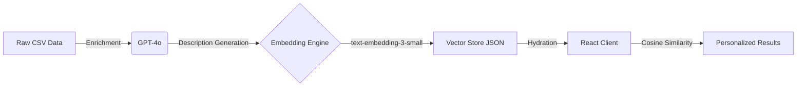

# 🌊 Lekker Find

> **The AI-native discovery engine for Cape Town.**  
> A privacy-first, client-side recommendation system that matches 250+ curated spots to your vibe using semantic search.

[](https://lekker-find.co.za)
[](LICENSE)
[](https://www.typescriptlang.org/)
[](https://reactjs.org/)
[](https://vitejs.dev/)

---

## 🚀 Overview

**Lekker Find** reimagines local discovery by moving beyond keyword search. Instead of "pizza" or "hike", it understands "romantic hidden gem with a view" or "cheap eats that feel authentic".

Built as a **technical showcase** of modern AI engineering, it features a **serverless vector search architecture** that runs entirely in the user's browser, ensuring zero latency and 100% privacy.

### Why is this special?
- **🧠 Zero-Backend AI**: Performs vector similarity search (Cosine Similarity) over 256-dimensional embeddings directly in JavaScript.
- **⚡ sub-100ms Interactions**: Pre-computed embeddings + React 18 concurrency = instant results.
- **🎨 Creative Direction**: A bespoke design system inspired by Cape Town's ocean/sunset palette, utilizing advanced CSS glassmorphism and Framer Motion orchestrations.

---

## 🛠️ Architecture

Lekker Find uses a sophisticated **ETL (Extract, Transform, Load)** pipeline to turn raw data into a smart client-side application.



### 1. Data Pipeline (Python & OpenAI)
- **Ingestion**: Raw venue data is managed via a custom Admin Tool (`admin/add-venue.html`).
- **Enrichment**: A Python script (`enrich_venues.py`) uses **GPT-4o** to generate rich, semantic descriptions based on raw tags.
- **Vectorization**: `generate_embeddings.py` converts these descriptions into **256-dimensional vectors** using OpenAI's `text-embedding-3-small` model.
- **Optimization**: Vectors are quantized and optimized for client-side delivery (~2MB total payload).

### 2. Frontend Core (React & TypeScript)
- **Vector Search**: A custom `Matcher` class implements optimized cosine similarity math using `Float32Array` for maximum performance.
- **State Management**: Complex multi-step wizard state (Intent → Persona → Budget → Vibes) handled with precision.
- **Performance**:
    - **App Shell**: Instant paint with zero layout shift (CLS 0).
    - **LCP Optimization**: Preloaded critical assets and `fetchpriority` hints.
    - **Lazy Loading**: Code splitting for non-critical routes.

---

## ✨ Key Features

### 🎯 Semantic Vibe Matching
Unlike traditional filters, our engine understands nuance. A search for "quiet nature spot" matches venues tagged with `Peaceful`, `Secret`, and `Scenic` via vector proximity, even if the exact words don't match.

### 💰 Real-Time Currency Logic
A built-in currency engine converts ZAR prices to **USD**, **EUR**, or **GBP** using live exchange rates, making the app accessible to international tourists immediately.

### 🕵️ Local vs. Tourist Personalization
The engine adjusts rankings based on user persona:
- **Locals**: Filters out "Tourist Traps" (Tourist Level > 7).
- **Visitors**: Boosts iconic landmarks while still suggesting safe hidden gems.
- **Explorers**: Pure, unfiltered discovery.

### 📊 Smart Ranking & Boosting
The algorithm implements a "Satisfaction Boost" logic:
- **Base Score**: Semantic match (0-100%)
- **Quality Boost**: Venues with exceptionally high ratings (4.8+) get a **+5% probability boost**.
- **Penalty Box**: Venues with ratings < 4.0 are automatically filtered out of the dataset.

---

## 🎨 Design System

The UI is built on a custom design system that prioritizes "Joy of Use".

- **Micro-interactions**: Every button press, toggle, and card swipe is animated with spring physics (Framer Motion).
- **Glassmorphism**: Context-aware blur effects to maintain legibility over rich background imagery.
- **Typography**: Uses a variable font (**Inter**) for perfect readability at any weight.
- **Touch-First**: Optimized hit targets (min 44px) and swipe gestures for mobile users.

---

## 🏃‍♂️ Getting Started

### Prerequisites
- Node.js 18+
- OpenAI API Key (for data pipeline only)

### Installation

```bash
# Clone the repository
git clone https://github.com/mfsass/lekker-find.git

# Install dependencies
npm install

# Start development server
npm run dev
```

### Running the Data Pipeline (Optional)

If you want to add venues or regenerate embeddings:

```bash
# Install Python dependencies
pip install openai pandas python-dotenv

# Run the Admin Server
python scripts/serve_admin.py

# Visit http://localhost:8000/admin/add-venue.html
```

---

## 📁 Project Structure

```bash
src/
├── components/         # React components (Atomic design)
│   ├── ui/             # Reusable primitives (Buttons, Cards)
│   └── wizard/         # Step-by-step flow logic
├── utils/              # Core logic
│   ├── matcher.ts      # 🧠 The Vector Search Engine
│   └── currency.ts     # 💱 Exchange rate logic
├── styles/             # Global CSS & Design Tokens
└── scripts/            # 🐍 Python ETL Pipeline
    ├── enrich_venues.py       # GPT-4o description generator
    ├── generate_embeddings.py # Vector creation
    └── serve_admin.py         # Automation server
```

---

## 📄 License

MIT © [Markus Sass](https://github.com/mfsass)

Made with 🌊 in Cape Town.
