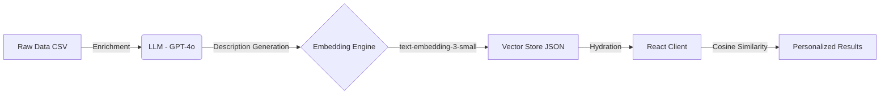

# AI-Native Discovery App - Generic Specification Document

A comprehensive, reusable specification document derived from the Lekker Find codebase for building semantically-powered discovery applications.

---

## Overview

This document provides a complete blueprint for building AI-native discovery apps using semantic embeddings. While Lekker Find focuses on "things to do," this spec is domain-agnostic and can be adapted for:

- **What to Eat** - Restaurant/cuisine recommendations
- **Where to Stay** - Accommodation discovery
- **What to Watch** - Media/entertainment suggestions
- **What to Buy** - Product recommendations
- **Where to Go** - Travel destinations

---

## 1. Architecture Principles

### 1.1 Core Philosophy

| Principle | Implementation |
|:----------|:--------------|
| **Vibe-first** | Match feelings/moods, not keywords |
| **Quality over quantity** | Curated items, every one vetted |
| **Instant & offline** | All logic runs client-side |
| **Local soul** | Speak the user's language authentically |
| **Zero-backend AI** | Pre-computed embeddings, no runtime API calls |

### 1.2 High-Level Architecture



### 1.3 Tech Stack

| Layer | Technology | Purpose |
|:------|:-----------|:--------|
| **Framework** | React 18 + TypeScript | Type-safe, concurrent rendering |
| **Build** | Vite 6 | Fast HMR, optimized bundling |
| **Styling** | Tailwind CSS + CSS Variables | Design tokens, utility-first |
| **Animation** | Framer Motion (LazyMotion) | Performant micro-interactions |
| **Icons** | Lucide React | Consistent, lightweight icons |
| **Analytics** | PostHog + Microsoft Clarity | Privacy-conscious tracking |
| **Hosting** | Vercel/Static | Free tier, CDN delivery |
| **Data Pipeline** | Python + OpenAI API | One-time embedding generation |

---

## 2. Data Pipeline (ETL)

### 2.1 Source Data Schema

```typescript
interface Item {
  id: string;
  name: string;
  category: string;         // e.g., "Food" | "Activity" | "Nature"
  vibes: string[];          // ["Romantic", "Hidden", "Scenic"]
  description: string;      // Rich semantic description
  price_tier: string;       // "Free" | "R" | "RR" | "RRR"
  numerical_price: number;  // Actual price for sorting
  tourist_level: number;    // 1-10 (hidden gems → famous)
  best_season?: string;
  embedding: number[];      // 256-dimensional vector
  
  // Optional enrichments
  place_id?: string;        // Google Places ID
  maps_url?: string;
  image_url?: string;
  rating?: number;          // 1-5 stars
  suburb?: string;          // Location context
}
```

### 2.2 Embedding Generation

**Model Configuration:**
- **Model:** `text-embedding-3-small` (OpenAI)
- **Dimensions:** `256` (Matryoshka truncation)
- **Cost:** ~$0.01 one-time per 300 items
- **File Size:** ~2MB for 300+ items

**Tag Consolidation Strategy:**
```
Raw tags (300+) → Curated taxonomy (40)
├── Mood (8): Chill, Lively, Romantic, Adventurous, Peaceful, Social, Quirky, Authentic
├── Setting (8): Coastal, Nature, Urban, Historic, Scenic, Hidden, Industrial, Indoor
├── Crowd (5): Date-Night, Family-Friendly, Group-Fun, Solo-Friendly, Trendy
└── Style (8): Casual, Upscale, Artsy, Retro, Modern, Cozy, Foodie, Budget-Friendly
```

### 2.3 Python Scripts

| Script | Purpose |
|:-------|:--------|
| [generate_embeddings.py](file:///c:/Users/markussass/OneDrive%20-%20StratHost%20Office%20365/Documents/lekker-find/scripts/generate_embeddings.py) | Create 256d vectors from descriptions |
| [enrich_venues.py](file:///c:/Users/markussass/OneDrive%20-%20StratHost%20Office%20365/Documents/lekker-find/scripts/enrich_venues.py) | GPT-4o description generation |
| [clean_data.py](file:///c:/Users/markussass/OneDrive%20-%20StratHost%20Office%20365/Documents/lekker-find/scripts/clean_data.py) | Normalize and validate CSV |
| [remove_duplicates.py](file:///c:/Users/markussass/OneDrive%20-%20StratHost%20Office%20365/Documents/lekker-find/scripts/remove_duplicates.py) | Dedupe entries |
| [add_places.py](file:///c:/Users/markussass/OneDrive%20-%20StratHost%20Office%20365/Documents/lekker-find/scripts/add_places.py) | Google Places API integration |
| [localize_images.py](file:///c:/Users/markussass/OneDrive%20-%20StratHost%20Office%20365/Documents/lekker-find/scripts/localize_images.py) | Download images for offline |

---

## 3. Client-Side Matching Engine

### 3.1 Vector Math Functions

```typescript
// Cosine similarity (OpenAI embeddings are pre-normalized)
function cosineSimilarity(a: number[], b: number[]): number {
  let dotProduct = 0;
  for (let i = 0; i < a.length; i++) {
    dotProduct += a[i] * b[i];
  }
  return dotProduct;
}

// Mean pooling for multi-selection
function meanPool(embeddings: number[][]): number[] {
  const dimensions = embeddings[0].length;
  const mean = new Array(dimensions).fill(0);
  for (const emb of embeddings) {
    for (let i = 0; i < dimensions; i++) {
      mean[i] += emb[i];
    }
  }
  for (let i = 0; i < dimensions; i++) {
    mean[i] /= embeddings.length;
  }
  return mean;
}

// Embedding subtraction for "avoid" preferences
function subtractVectors(a: number[], b: number[]): number[] {
  return a.map((val, i) => val - b[i]);
}
```

### 3.2 Scoring Algorithm

```typescript
// Hybrid search: Vector similarity + Keyword boost + Rating boost
const score = calculateScore(venue) {
  // 1. Base semantic score
  let rawScore = cosineSimilarity(userVibe, venue.embedding);
  
  // 2. Keyword boost (+8% per exact match)
  const keywordBoost = matchingVibes.length * 0.08;
  
  // 3. Explicit avoid penalty (Hard filter)
  const avoidPenalty = matchesAvoid ? 2.0 : 0;
  
  const boostedScore = rawScore + keywordBoost - avoidPenalty;
  
  // 4. Relative scaling (55-90% range)
  const normalized = (boostedScore - lowestScore) / scoreRange;
  let basePercent = 55 + (normalized * 35);
  
  // 5. Rating quality boost
  if (venue.rating >= 4.9) ratingBonus = 5;
  else if (venue.rating >= 4.7) ratingBonus = 3;
  else if (venue.rating >= 4.5) ratingBonus = 1;
  else if (venue.rating < 4.0) ratingBonus = -5;
  
  return Math.round(basePercent + ratingBonus);
}
```

### 3.3 React Hook

```typescript
export function useRecommendations(): {
  findMatches: (params: MatchParams, options?: MatchOptions) => VenueWithMatch[];
  surpriseMe: (count?: number) => VenueWithMatch[];
  loading: boolean;
  error: Error | null;
  ready: boolean;
  totalVenues: number;
}
```

---

## 4. User Experience Flow

### 4.1 Multi-Step Wizard

```
Landing Page
     ↓
[Get Started]    [Feeling Curious?]
     ↓                   ↓
┌────────────────────────────────────┐
│ Step 1: Intent                     │
│ "What are you in the mood for?"    │
│ Food · Activity · Culture · Any    │
└────────────────────────────────────┘
     ↓
┌────────────────────────────────────┐
│ Step 2: Discovery Level            │
│ "How adventurous are you feeling?" │
│ Icons → Hotspots → Mix → Local → Hidden │
└────────────────────────────────────┘
     ↓
┌────────────────────────────────────┐
│ Step 3: Budget                     │
│ "What's your budget?"              │
│ Free · R · RR · RRR · Any          │
└────────────────────────────────────┘
     ↓
┌────────────────────────────────────┐
│ Step 4: Vibes (Multi-select 1-4)   │
│ "Pick up to 4 vibes"               │
│ [Romantic] [Hidden] [Scenic] ...   │
└────────────────────────────────────┘
     ↓
┌────────────────────────────────────┐
│ Step 5: Avoid (Optional refine)    │
│ "Anything to avoid?"               │
│ [Beach] [Crowded] [Expensive] ...  │
└────────────────────────────────────┘
     ↓
   Swipeable Results (20 cards)
```

### 4.2 State Management

```typescript
type AppStep = 
  | 'landing' 
  | 'question-intent' 
  | 'question-vibe' 
  | 'question-budget' 
  | 'question-mood' 
  | 'question-avoid' 
  | 'results';

// Core state
const [currentStep, setCurrentStep] = useState<AppStep>('landing');
const [selectedIntent, setSelectedIntent] = useState<string | null>(null);
const [selectedTouristLevel, setSelectedTouristLevel] = useState<number | null>(null);
const [selectedBudget, setSelectedBudget] = useState<string | null>(null);
const [selectedMoods, setSelectedMoods] = useState<string[]>([]);  // Max 4
const [avoidedMoods, setAvoidedMoods] = useState<string[]>([]);    // Max 4
```

---

## 5. Design System

### 5.1 Design Tokens

```css
:root {
  /* Primary - Domain-specific accent */
  --primary-h: 174;           /* Adjust per brand */
  --primary-s: 72%;
  --primary-l: 40%;
  --primary: hsl(var(--primary-h) var(--primary-s) var(--primary-l));
  --primary-foreground: hsl(0 0% 100%);
  
  /* Secondary - Complementary accent */
  --secondary: hsl(24 95% 53%);
  
  /* Neutral Palette */
  --background: hsl(40 20% 98%);
  --foreground: hsl(220 20% 14%);
  --muted: hsl(40 15% 92%);
  --muted-foreground: hsl(220 10% 40%);
  --border: hsl(40 15% 88%);
  
  /* Sizing */
  --radius-sm: 0.5rem;
  --radius-lg: 1rem;
  --radius-xl: 1.5rem;
  --radius-full: 9999px;
  
  /* Shadows */
  --shadow-sm: 0 1px 2px hsla(220, 20%, 10%, 0.05);
  --shadow-lg: 0 8px 30px hsla(220, 20%, 10%, 0.12);
  --shadow-primary: 0 8px 30px hsla(174, 72%, 40%, 0.3);
  
  /* Transitions */
  --transition-fast: 150ms cubic-bezier(0.4, 0, 0.2, 1);
  --transition-normal: 250ms cubic-bezier(0.4, 0, 0.2, 1);
}
```

### 5.2 Component Patterns

| Component | Key Classes |
|:----------|:------------|
| **Primary Button** | `rounded-full shadow-primary hover:-translate-y-0.5` |
| **Card** | `rounded-xl overflow-hidden shadow-lg hover:shadow-xl` |
| **Tag (unselected)** | `rounded-full bg-muted text-muted-foreground` |
| **Tag (selected)** | `rounded-full bg-primary ring-2 ring-primary` |
| **Glass Effect** | `bg-white/80 backdrop-blur-lg` |

### 5.3 Animation Principles

```typescript
// Fade up for content
const fadeUp = {
  initial: { opacity: 0, y: 20 },
  animate: { opacity: 1, y: 0 },
  transition: { duration: 0.4, ease: 'easeOut' }
};

// Stagger for lists
const stagger = {
  animate: { transition: { staggerChildren: 0.06 } }
};

// Press feedback
const tap = { whileTap: { scale: 0.97 } };
```

---

## 6. SEO & LLM Optimization

### 6.1 HTML Structure

```html
<!-- Critical Meta Tags -->
<title>[Domain] | [Action] in [Location]</title>
<meta name="description" content="...">
<link rel="canonical" href="https://...">

<!-- Open Graph -->
<meta property="og:title" content="...">
<meta property="og:description" content="...">
<meta property="og:image" content="...">
<meta property="og:locale" content="en_ZA">

<!-- Twitter Card -->
<meta name="twitter:card" content="summary_large_image">
<meta name="twitter:image" content="...">

<!-- Favicons (48x48 for Google) -->
<link rel="icon" type="image/png" sizes="48x48" href="/favicon-48x48.png">
<link rel="apple-touch-icon" sizes="180x180" href="/apple-touch-icon.png">
<link rel="manifest" href="/site.webmanifest">
```

### 6.2 JSON-LD Structured Data

```json
{
  "@context": "https://schema.org",
  "@type": "WebApplication",
  "name": "[App Name]",
  "description": "...",
  "applicationCategory": "TravelApplication",
  "operatingSystem": "Web",
  "offers": {
    "@type": "Offer",
    "price": "0",
    "priceCurrency": "ZAR"
  },
  "areaServed": {
    "@type": "City",
    "name": "[Location]"
  },
  "aggregateRating": {
    "@type": "AggregateRating",
    "ratingValue": "4.9",
    "reviewCount": "320"
  }
}
```

### 6.3 FAQ Schema (LLM-Friendly)

```json
{
  "@type": "FAQPage",
  "mainEntity": [
    {
      "@type": "Question",
      "name": "What are the best [items] in [location]?",
      "acceptedAnswer": {
        "@type": "Answer",
        "text": "The best [items] include..."
      }
    }
  ]
}
```

---

## 7. Performance Targets

| Metric | Target |
|:-------|:-------|
| **LCP** | < 2.5s |
| **FID** | < 100ms |
| **CLS** | 0 |
| **Bundle Size** | < 1MB |
| **Time to First Result** | < 500ms |
| **Match Calculation** | < 100ms |
| **Lighthouse Score** | > 90 |

### 7.1 Optimization Strategies

- **App Shell** - Pre-render splash screen in HTML
- **Lazy Loading** - Code split heavy components (SwipeableResults, LoadingScreen)
- **Preload** - Critical logo and fonts
- **LazyMotion** - Load only domAnimation subset
- **Low Priority Fetch** - Load embeddings data with `priority: 'low'`

---

## 8. File Structure

```
project/
├── index.html              # App shell, SEO meta, JSON-LD
├── package.json            # Dependencies
├── vite.config.ts          # Build configuration
├── tsconfig.json           # TypeScript config
│
├── public/
│   ├── lekker-find-data.json   # Pre-computed embeddings
│   ├── images/                  # Local venue images
│   ├── favicon-*.png            # Favicons
│   └── site.webmanifest         # PWA manifest
│
├── src/
│   ├── main.tsx            # Entry point
│   ├── App.tsx             # Main app + wizard logic
│   ├── index.css           # Design system + global styles
│   │
│   ├── components/
│   │   └── ui/
│   │       ├── SwipeableResults.tsx   # Card swipe interaction
│   │       ├── LoadingScreen.tsx      # Animated loading
│   │       ├── AnimatedLogo.tsx       # Brand logo animation
│   │       └── ErrorBoundary.tsx      # Graceful error handling
│   │
│   ├── utils/
│   │   ├── matcher.ts         # Vector search engine
│   │   ├── vibeDispersion.ts  # Diverse vibe selection
│   │   ├── analytics.ts       # Event tracking
│   │   └── currency.ts        # Exchange rate logic
│   │
│   └── data/
│       └── vibes.ts           # Curated tag definitions
│
├── scripts/                # Python ETL pipeline
│   ├── generate_embeddings.py
│   ├── enrich_venues.py
│   ├── clean_data.py
│   └── add_places.py
│
└── docs/                   # Documentation
    ├── lekker-find-spec-v1.md
    └── embedding-benchmark.md
```

---

## 9. Adaptation Checklist

When adapting for a new domain (e.g., "What to Eat"):

### 9.1 Data Changes
- [ ] Define domain-specific categories
- [ ] Create curated tag taxonomy
- [ ] Map raw tags to consolidated vibes
- [ ] Generate new embeddings

### 9.2 UI Changes
- [ ] Update branding (logo, colors)
- [ ] Modify wizard questions for domain
- [ ] Adapt result card content
- [ ] Update loading messages

### 9.3 SEO Changes
- [ ] Update meta tags for domain
- [ ] Modify JSON-LD schema type
- [ ] Create domain-specific FAQs
- [ ] Update keywords

---

## 10. Verification Plan

### 10.1 Automated Tests
- Build verification: `npm run build`
- Type checking: `tsc --noEmit`
- Lint: `npm run lint`

### 10.2 Manual Testing
1. **Landing Page** - Logo renders, CTAs clickable, footer visible
2. **Wizard Flow** - All 5 steps navigate correctly
3. **Results** - Swipe cards work, match % displays
4. **Mobile** - 320px width works, touch targets 44px+
5. **Lighthouse** - Run audit, verify >90 score

---

## Summary

This specification provides a complete, production-ready blueprint for building AI-native discovery apps. The key innovations are:

1. **Client-side vector search** - Zero latency, 100% privacy
2. **Hybrid scoring** - Semantic + keyword + quality boosts
3. **Preference refinement** - Embedding subtraction for "avoid"
4. **Progressive disclosure** - Multi-step wizard reduces cognitive load
5. **Premium design** - Glassmorphism, spring physics, 60fps animations

The architecture is domain-agnostic and can power any recommendation experience where users express preferences through vibes rather than keywords.

USER SELECTS: Romantic, Coastal, Hidden
USER AVOIDS:  Lively

↓

STEP 1: Fetch tag embeddings
  Romantic → [256 numbers]
  Coastal  → [256 numbers]
  Hidden   → [256 numbers]
  Lively   → [256 numbers]

↓

STEP 2: Combine liked vibes
  mean([Romantic, Coastal, Hidden]) → [256 numbers, length ~0.85]
  normalize → [256 numbers, length = 1.0] = "likedVector"

↓

STEP 3: Combine avoided vibes
  mean([Lively]) → [256 numbers, length = 1.0] = "avoidVector"

↓

STEP 4: Create final preference
  likedVector - avoidVector → [256 numbers, length ~0.9]
  normalize → [256 numbers, length = 1.0] = "userVibe"

↓

STEP 5: Score all venues
  FOR each venue:
    rawScore = dot(userVibe, venue.embedding)  
    keywordBoost = +8% if venue has "Romantic" or "Coastal" tag
    avoidPenalty = -200% if venue has "Lively" tag
    boostedScore = rawScore + keywordBoost - avoidPenalty

↓

STEP 6: Convert to percentages
  FOR each score:
    scaledSim = score^0.7
    basePercent = 40 + (scaledSim × 48)
    ratingBonus = +4% if venue rating > 4.9
    topBoost = +3% if this is the highest score
    finalPercent = clamp(basePercent + bonuses, 35%, 98%)

↓

STEP 7: Sort and return top 20
  Sort by matchPercentage descending
  Return first 20 venues